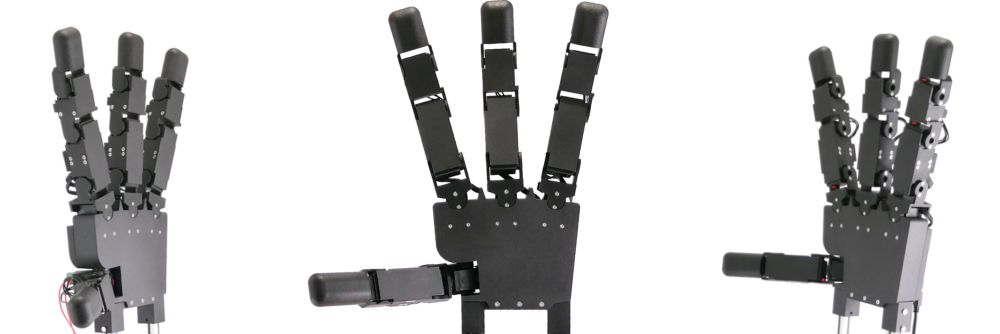

.. Tilburg Hand documentation master file, created by
   sphinx-quickstart on Sun Jul 10 10:56:25 2022.
   You can adapt this file completely to your liking, but it should at least
   contain the root `toctree` directive.

Welcome to Tilburg Hand's documentation!
========================================

|

This is the documentation for the basic software and Python interface for the `Tilburg Hand <https://www.tilburg-robotics.eu>`_. The Tilburg Hand is a new low-cost, Open Source robot hand designed for research on dexterous manipulation with Deep Reinforcement Learning.

|

Contents
==================

.. toctree::
   :maxdepth: 2

   main
   simulation
   examples
   motor_interface
   modindex
